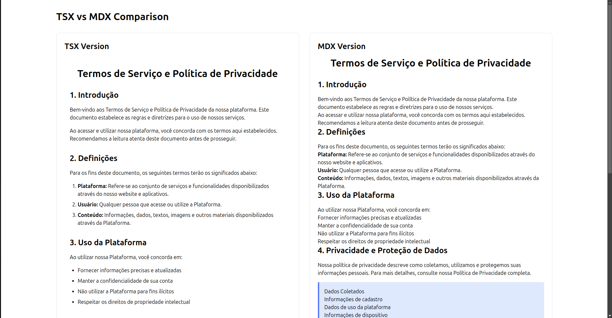

# Example TSX + MDX Project

Este projeto é um exemplo de aplicação React utilizando:

- **React** com **TypeScript** (TSX)
- **MDX** para páginas de conteúdo ricas
- **Vite** como bundler
- **Tailwind CSS** para estilização
- **PNPM** como gerenciador de pacotes

## Como rodar localmente

1. Instale as dependências:
   ```sh
   pnpm install
   ```
2. Inicie o servidor de desenvolvimento:
   ```sh
   pnpm dev
   ```
3. Acesse em [http://localhost:5173](http://localhost:5173)

## Estrutura
- `src/components/DocumentPage.tsx`: Exemplo de página em TSX
- `src/components/DocumentPage.mdx`: Exemplo de página em MDX
- `src/components/mdx/`: Componentes customizados para uso em MDX

## Observações
- O projeto suporta frontmatter em arquivos MDX (via `remark-frontmatter`).
- Componentes React podem ser usados diretamente dentro do MDX.
- Teste e explore MDX online no [MDX Playground](https://mdxjs.com/playground/).

---
Sinta-se à vontade para adaptar este projeto para suas necessidades! 